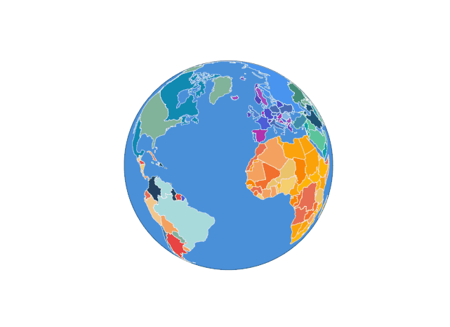

# @keremmert/react-world-map

A customizable, SVG-based interactive world map React library. No Google Maps, Leaflet, or Mapbox — pure SVG rendering with D3-geo projections, zoom/pan, orthographic globe, country/state styling, tooltips, and more.



---

## Installation

```bash
npm install @keremmert/react-world-map
```

Requires React 17+ as a peer dependency.

---

## Quick Start

```tsx
import { WorldMap } from '@keremmert/react-world-map'

export default function App() {
  return (
    <div style={{ width: '100%', height: 500 }}>
      <WorldMap />
    </div>
  )
}
```

Renders the full world map using Natural Earth data with the `naturalEarth` projection by default.

---

## Props Reference

### Appearance

| Prop | Type | Default | Description |
|------|------|---------|-------------|
| `width` | `number \| string` | `'100%'` | SVG width |
| `height` | `number \| string` | `'100%'` | SVG height |
| `projection` | `ProjectionType` | `'naturalEarth'` | Map projection |
| `backgroundColor` | `string` | `'#a8d8ea'` | Ocean / background color |
| `defaultCountryColor` | `string` | `'#d4d4d4'` | Default country fill color |
| `defaultBorderColor` | `string` | `'#ffffff'` | Default border color |
| `defaultBorderWidth` | `number` | `0.5` | Default border width |
| `colorScheme` | `ColorScheme` | — | Built-in color scheme |

**ProjectionType:** `'naturalEarth'` · `'mercator'` · `'orthographic'` · `'equirectangular'`

**ColorScheme:** `'default'` · `'continent'` · `'monochrome'` · `'dark'`

---

### Zoom & Pan

| Prop | Type | Default | Description |
|------|------|---------|-------------|
| `zoomable` | `boolean` | `true` | Enable zoom/pan |
| `minZoom` | `number` | `0.5` | Minimum zoom level |
| `maxZoom` | `number` | `12` | Maximum zoom level |
| `initialZoom` | `number` | `1` | Initial zoom level |
| `initialCenter` | `[number, number]` | — | Initial center `[lng, lat]` |
| `showZoomControls` | `boolean` | `false` | Show +/− buttons |

---

### Events

| Prop | Type | Description |
|------|------|-------------|
| `onCountryClick` | `(feature: MapFeature) => void` | Fired when a country is clicked |
| `onCountryHover` | `(feature: MapFeature \| null) => void` | Fired on country hover / mouse leave |
| `onStateClick` | `(feature: MapFeature) => void` | Fired when a state/province is clicked |
| `onMapClick` | `(coords: { lat: number; lng: number }) => void` | Fired on empty map area click |

**MapFeature object:**
```ts
{
  id: string           // ISO 3166-1 alpha-3 (e.g. 'TUR')
  name: string         // Country name
  type: 'country' | 'state' | 'sea'
  properties: Record<string, unknown>
}
```

---

### Tooltip

| Prop | Type | Default | Description |
|------|------|---------|-------------|
| `showTooltip` | `boolean` | `true` | Show default tooltip on hover |
| `tooltipContent` | `(feature: MapFeature) => ReactNode` | — | Custom tooltip renderer |

---

### Labels

| Prop | Type | Default | Description |
|------|------|---------|-------------|
| `showLabels` | `boolean` | `false` | Show country name labels |
| `labelFontSize` | `number` | `10` | Base font size (px) |
| `labelColor` | `string` | `'#333333'` | Label color |

Labels include automatic collision detection. Less important countries appear at higher zoom levels.

---

### Capitals

| Prop | Type | Default | Description |
|------|------|---------|-------------|
| `showCapitals` | `boolean` | `false` | Show capital city markers |
| `capitalSize` | `number` | `3` | Dot size (px) |
| `capitalColor` | `string` | `'#222222'` | Dot and label color |
| `showCapitalLabels` | `boolean` | `false` | Show capital city names |

---

### State / Province Borders

Province border data is included in the package and imported separately:

```tsx
import statesData from '@keremmert/react-world-map/data/states'

<WorldMap
  showStateBorders
  statesData={statesData as GeoJSON.FeatureCollection}
/>
```

| Prop | Type | Default | Description |
|------|------|---------|-------------|
| `showStateBorders` | `boolean` | `false` | Show state/province borders |
| `statesData` | `GeoJSON.FeatureCollection` | — | Border data (required) |
| `stateBorderColor` | `string` | `'rgba(0,0,0,0.2)'` | Border color |
| `stateBorderWidth` | `number` | `0.4` | Border width |
| `showStateBordersFor` | `string[]` | — | Show only for specific countries (alpha-3 codes) |

---

### Graticule

| Prop | Type | Default | Description |
|------|------|---------|-------------|
| `showGraticule` | `boolean` | `false` | Show lat/lng grid lines |
| `graticuleColor` | `string` | `'rgba(0,0,0,0.08)'` | Grid line color |

---

### Orthographic Globe

Set `projection="orthographic"` to enable a draggable 3D globe. Scroll to zoom, drag to rotate.

| Prop | Type | Default | Description |
|------|------|---------|-------------|
| `initialRotate` | `[number, number, number]` | `[0, -20, 0]` | Initial rotation `[lambda, phi, gamma]` |
| `autoRotate` | `boolean` | `false` | Auto-spin the globe |
| `rotateSpeed` | `number` | `6` | Auto-rotate speed (degrees/second) |
| `rotateSensitivity` | `number` | `0.4` | Drag sensitivity |

---

### Data Customization

#### `world` prop — full world config

```tsx
import worldConfig from './my-world.json'

<WorldMap world={worldConfig} />
```

```json
{
  "countries": [
    {
      "id": "TUR",
      "color": "#e63946",
      "borderColor": "#ffffff",
      "borderWidth": 1
    }
  ],
  "seas": [
    {
      "id": "mediterranean",
      "color": "#4a90d9"
    }
  ],
  "projection": "naturalEarth",
  "backgroundColor": "#a8d8ea"
}
```

#### `countries` prop — per-country overrides

```tsx
<WorldMap
  countries={[
    { id: 'TUR', color: 'red', name: 'Turkey' },
    { id: 'DEU', color: '#ffcc00' },
  ]}
/>
```

**CountryConfig fields:**

| Field | Type | Description |
|-------|------|-------------|
| `id` | `string` | ISO 3166-1 alpha-3 code (required) |
| `name` | `string` | Display name |
| `color` | `string` | Fill color |
| `borderColor` | `string` | Border color |
| `borderWidth` | `number` | Border width |
| `visible` | `boolean` | Show/hide country |
| `clickable` | `boolean` | Enable click events |
| `states` | `StateConfig[]` | Sub-region config |
| `customGeometry` | `GeoJSON.Feature` | Replace default geometry |

---

## Examples

### 1. Basic interactive map

```tsx
import { WorldMap, MapFeature } from '@keremmert/react-world-map'

function App() {
  const [selected, setSelected] = useState<string | null>(null)

  return (
    <WorldMap
      height={500}
      countries={selected ? [{ id: selected, color: '#e63946' }] : []}
      onCountryClick={(f: MapFeature) => setSelected(f.id)}
      showTooltip
    />
  )
}
```

### 2. Color schemes

```tsx
<WorldMap colorScheme="continent" height={400} />
<WorldMap colorScheme="dark" height={400} />
```

### 3. Custom tooltip

```tsx
<WorldMap
  tooltipContent={(feature) => (
    <div style={{ padding: 8, background: '#222', color: '#fff', borderRadius: 4 }}>
      <strong>{feature.name}</strong>
      <div>Code: {feature.id}</div>
    </div>
  )}
/>
```

### 4. Focus on a region

```tsx
<WorldMap
  initialCenter={[35, 39]}   // Turkey
  initialZoom={3}
  showZoomControls
/>
```

### 5. Orthographic globe

```tsx
<WorldMap
  projection="orthographic"
  initialRotate={[30, -30, 0]}
  autoRotate
  rotateSpeed={4}
  showGraticule
  showLabels
  showCapitals
  showZoomControls
/>
```

### 6. Province borders for all countries

```tsx
import statesData from '@keremmert/react-world-map/data/states'
import type { FeatureCollection } from 'geojson'

<WorldMap
  showStateBorders
  statesData={statesData as FeatureCollection}
  stateBorderColor="rgba(0,0,0,0.15)"
/>
```

### 7. Province borders for specific countries

```tsx
import statesData from '@keremmert/react-world-map/data/states'

<WorldMap
  showStateBorders
  statesData={statesData as FeatureCollection}
  showStateBordersFor={['TUR', 'USA', 'DEU']}
  onStateClick={(state) => console.log(state.id, state.name)}
/>
```

### 8. Custom geometry

Replace a country's borders entirely:

```tsx
import myRegion from './my-region.geo.json'

<WorldMap
  countries={[{
    id: 'CUSTOM',
    name: 'My Region',
    color: '#ff6b6b',
    customGeometry: myRegion,
  }]}
/>
```

### 9. Click coordinates

```tsx
<WorldMap
  onMapClick={({ lat, lng }) => {
    console.log(`Clicked: ${lat.toFixed(2)}°N, ${lng.toFixed(2)}°E`)
  }}
/>
```

---

## TypeScript

Full TypeScript support. All types are exported:

```ts
import type {
  WorldMapProps,
  CountryConfig,
  StateConfig,
  SeaConfig,
  WorldConfig,
  MapFeature,
  ProjectionType,
} from '@keremmert/react-world-map'
```

The states data import is also typed automatically:

```ts
import statesData from '@keremmert/react-world-map/data/states'
// statesData: FeatureCollection<MultiPolygon | Polygon>
```

---

## Data Sources

Map data is from [Natural Earth](https://www.naturalearthdata.com/) (public domain):

- **Countries:** ne_110m_admin_0 — 177 countries
- **Provinces/States:** ne_10m_admin_1 (simplified) — 3,462 regions
- **Seas:** 12 named sea polygons

---

## Technical Notes

- No Google Maps, Leaflet, or Mapbox dependency
- Pure SVG rendering via D3-geo
- No CSS file required (inline styles only)
- SSR safe
- React 17+ supported (ESM + CJS dual output)
- Bundle: ~931 KB ES / ~323 KB CJS (states data shipped separately)
